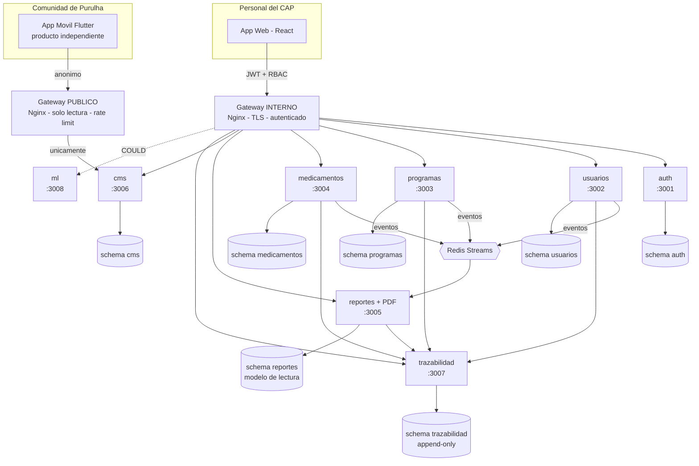
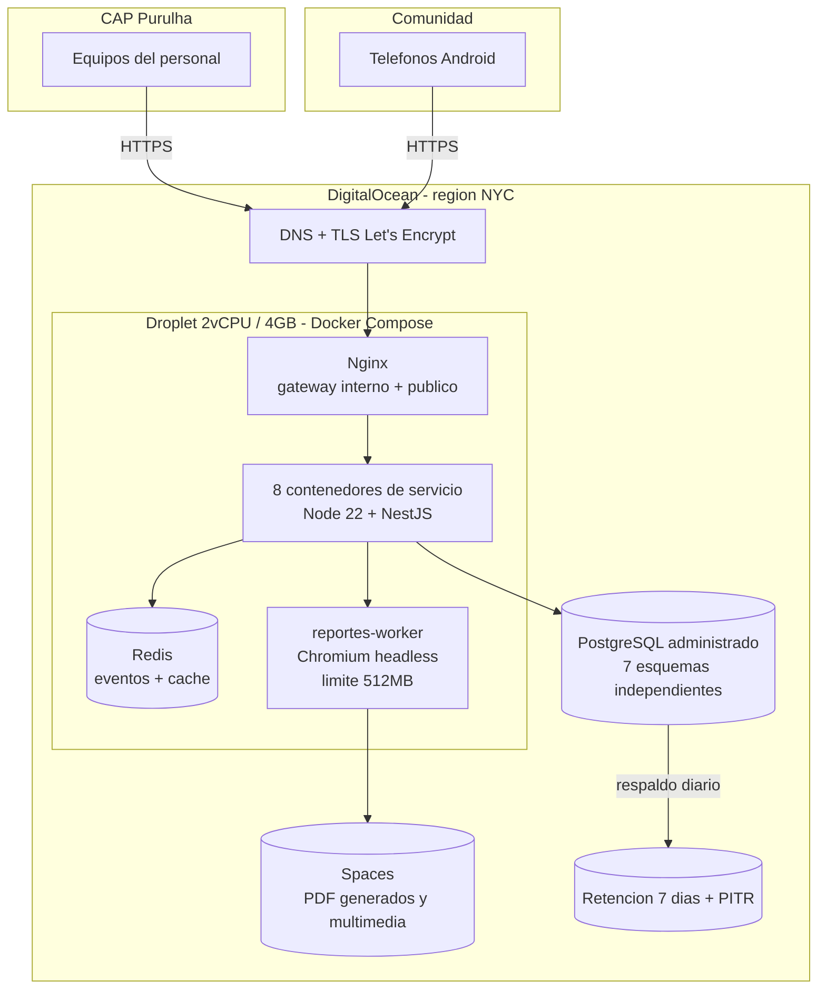

# Arquitectura: Plataforma Inteligente CAP Purulhá, Baja Verapaz

**Estado:** DEFINITIVA

**Versión del documento:** 2.0 · 2026-08-25
**Documento fuente:** `Plan de Desarrollo v2.docx` (versión 2.0 del plan, aprobada por el equipo)
**Equipo:** 3 integrantes (Dev A — Backend/Servicios, Dev B — Frontend Web, Dev C — Móvil)

## Decisiones críticas — todas resueltas

Las cinco decisiones que mantenían este documento en estado preliminar quedaron cerradas el 2026-08-25. La arquitectura está lista para implementarse.

| # | Decisión | Resolución | Consecuencia arquitectónica |
|---|---|---|---|
| **P-1** | Interoperabilidad con SIGSA / MSPAS | **DESCARTADA.** El sistema es independiente del MSPAS y no intercambia información con SIGSA | No se construye componente de integración. **Cero dependencias externas.** Aparece en cambio una consecuencia operativa: ver R-8 en §13.1 |
| **P-2** | Duración del proyecto | **El plazo no es una restricción de diseño.** Las 16 semanas eran una aproximación; el proyecto contará con el tiempo necesario | §14 deja de ser un calendario y pasa a ser una **secuencia de dependencias**. Lo que importa es el orden, no la fecha. La ruta crítica sigue vigente |
| **P-3** | Formatos oficiales de fichas | **El CAP proporcionará las fichas** que usa hoy para registrar información de pacientes | Se confirma el enfoque HTML + CSS de impresión para el PDF (§8.4). Queda un detalle menor a confirmar al recibirlas: si se imprimen en hoja en blanco o sobre papel preimpreso |
| **P-4** | Volumen de expedientes | **Sin cifra definida.** El CAP atiende a múltiples comunidades: la base de datos debe soportar un volumen amplio y creciente | Se sustituye la meta de 10,000 expedientes por un **objetivo de dimensionamiento de 100,000 pacientes / 1,000,000 de atenciones / 10 años** (§9.7). No es un número que el CAP deba confirmar: es el piso de diseño |
| **P-5** | Cuenta de nube | **DigitalOcean a nombre del CAP**, que cubre los costos a futuro | Se confirma DigitalOcean con PostgreSQL administrado. **Se descarta la alternativa Hetzner** y con ella el riesgo de que un estudiante tuviera que administrar respaldos (§13.2) |

---

## 1. Resumen del proyecto

El CAP (Centro de Atención Permanente) de Purulhá, Baja Verapaz, atiende hoy a su población con expedientes en papel. Eso hace lenta la atención, dificulta el seguimiento de programas de salud (hipertensión, embarazo, desnutrición infantil), y vuelve casi imposible producir indicadores confiables.

El proyecto entrega **dos productos independientes**:

1. **Sistema Web del CAP** — herramienta interna para el personal (recepción/archivo, médicos, enfermería, farmacia, dirección). Digitaliza expedientes, da seguimiento a programas, controla medicamentos, produce indicadores y **exporta e imprime las fichas oficiales ya llenas** (RF-07).
2. **Aplicación Móvil Android para la comunidad** — producto separado, de uso anónimo, que solo consume contenido educativo publicado por el CAP. No accede a datos clínicos en ningún caso.

**Lo que el sistema NO pretende:** eliminar el papel. Los expedientes físicos siguen existiendo en el CAP. El objetivo es agilizar y ordenar la atención, y que la ficha se imprima ya llena en lugar de escribirse a mano.

---

## 2. Requisitos y supuestos confirmados

### 2.1 Requisitos confirmados (del plan v2, decididos por el equipo y el CAP)

| Categoría | Requisito |
|---|---|
| Arquitectura | **Microservicios — requisito del seminario, no negociable.** 8 servicios (7 obligatorios + ML como COULD) |
| Orquestación | Docker + Docker Compose. **Kubernetes está descartado** por el volumen del CAP |
| Despliegue | Nube pública. Proveedor seleccionado: DigitalOcean. Costo cubierto por el CAP |
| Base de datos | PostgreSQL administrado, **un esquema independiente por microservicio** dentro de una sola instancia |
| Entrada | **Dos gateways separados**: interno autenticado (personal) y público de solo lectura (app móvil) |
| Reportes | Modelo de lectura propio (CQRS) alimentado por eventos + reconciliación nocturna |
| Seguridad | TLS 1.2+, cifrado por columna, **índice ciego (HMAC-SHA256)** para campos buscables, MFA TOTP, RBAC |
| Trazabilidad | Registro append-only con cadena de hash. **No se implementa blockchain real** |
| App móvil | Producto independiente, repositorio propio, ciclo de publicación propio |
| Interoperabilidad | **Ninguna.** El sistema es independiente del MSPAS y no intercambia datos con SIGSA (P-1 resuelta) |
| Escala de diseño | **100,000 pacientes / 1,000,000 de atenciones / 10 años de operación**, 20 usuarios concurrentes, consulta de expediente < 2 s (§9.7) |
| Disponibilidad | 99% en horario de atención. Requiere Internet (con conexión secundaria por datos móviles) |
| Plazo | **No es restricción de diseño.** El proyecto contará con el tiempo necesario. §14 define el orden de construcción, no un calendario |

### 2.2 Decisión cerrada en este documento

El plan v2 (§6.1, tabla de stack) dejaba abierto: *"Node.js con Express, **o** Python con FastAPI"*. **Esa decisión queda cerrada aquí a favor de Node.js + TypeScript**, por las razones de §4.

> **Acción derivada:** actualizar la tabla de stack de `Plan de Desarrollo v2.docx` §6.1 para que refleje esta decisión y no siga presentando dos opciones.

El plan v2 (§2.1, actividades de la Fase 1) incluía como pendiente: *"confirmar con la dirección del CAP si el sistema debe alimentar o convivir con los reportes que la unidad envía al SIGSA"*. **Resuelto: no hay interoperabilidad** (P-1).

> **Acción derivada:** reemplazar esa actividad en `Plan de Desarrollo v2.docx` §2.1 por el levantamiento de las cifras que el CAP reporta al MSPAS, para incorporarlas al panel de indicadores (ver R-8 en §13.1).

### 2.3 Supuestos (asumidos por falta de información — corregir si están mal)

- **S-1** — El equipo tiene experiencia previa en JavaScript/TypeScript o puede adquirirla durante las Etapas 0 a 2. *(Si el equipo domina Python muy por encima de TypeScript, esta decisión debe reabrirse.)*
- **S-2** — Los usuarios del sistema web trabajan desde computadoras del CAP con navegador moderno (Chrome/Edge actualizado). No se soporta Internet Explorer.
- **S-3** — El volumen de contenido multimedia del CMS es bajo (decenas de imágenes/audios, no miles de videos).
- **S-4** — No hay requisito de operación sin conexión (offline) en el sistema web. Si el CAP lo exige, es un cambio arquitectónico mayor.
- **S-5** — El CAP dispone de al menos una impresora funcional accesible desde los equipos del personal (necesario para RF-07).

---

## 3. Arquitectura propuesta

### 3.1 Estilo arquitectónico

**Microservicios con base de datos por servicio, comunicación síncrona vía HTTP/REST para consultas y asíncrona vía eventos para la construcción del modelo de lectura de reportes.**

Se aplican tres patrones que resuelven los problemas propios de este estilo:

| Patrón | Problema que resuelve |
|---|---|
| **Doble gateway** | Que la app pública de la comunidad no tenga ninguna ruta de red hacia datos clínicos |
| **CQRS / modelo de lectura** | Que el panel de indicadores no pueda hacer JOIN entre bases separadas |
| **Outbox transaccional** | Que un evento no se pierda si el servicio cae después de escribir en BD pero antes de publicar |

### 3.2 Cómo se hacen viables 8 microservicios con 3 personas

Este es el riesgo central del proyecto. La arquitectura lo mitiga con tres piezas construidas en la **Etapa 2** (§14), antes de escribir lógica de negocio:

1. **Servicio plantilla (`services/_plantilla`)** — un microservicio completo y funcional que no hace nada de negocio, pero ya trae resuelto: Dockerfile multi-etapa, healthcheck, logging estructurado, validación de JWT, manejo global de errores, conexión a PostgreSQL con Prisma, configuración por entorno, pruebas unitarias y e2e de ejemplo, y generación de OpenAPI. **Los otros siete servicios se copian de aquí.**
2. **Librería compartida (`packages/shared`, publicada internamente como `@cap/shared`)** — guard de JWT, decorador de roles, cliente de auditoría, utilidades de cifrado e índice ciego, logger, filtro de excepciones, módulo de salud. **Un fallo de seguridad se corrige en un solo lugar.**
3. **Pipeline único con matriz de servicios** — un solo workflow de GitHub Actions que detecta qué servicios cambiaron y construye/prueba/despliega solo esos, con la misma definición para los ocho.

**NestJS es el habilitador de esto.** Su estructura es rígida (módulos, controladores, providers, DTOs, inyección de dependencias), así que ocho servicios escritos por tres personas distintas terminan viéndose iguales. Es la razón principal por la que se descarta Express "pelado" y FastAPI: ambos dan libertad total de estructura, y sin una estructura impuesta ocho servicios terminan en ocho estilos distintos que después nadie mantiene. Este argumento no depende del plazo: es un problema de mantenibilidad a años, no de velocidad de entrega.

### 3.3 Los ocho microservicios

| # | Servicio | Carpeta | Puerto | Responsabilidad | RF |
|---|---|---|---|---|---|
| 1 | Usuarios y Acceso | `services/auth` | 3001 | Cuentas, roles, permisos, JWT, refresh, MFA TOTP, bloqueo por intentos | RF-06 |
| 2 | Información de Usuarios | `services/usuarios` | 3002 | Pacientes, grupos familiares, comunidades, expedientes, atenciones. Modo digitalización | RF-01, RF-08 |
| 3 | Programas de Salud | `services/programas` | 3003 | Hipertensión, embarazo, desnutrición infantil. Controles y seguimiento | RF-03 |
| 4 | Medicamentos | `services/medicamentos` | 3004 | Inventario, lotes, existencias, vencimientos, entregas | RF-02 |
| 5 | Reportes y DSS | `services/reportes` | 3005 | Modelo de lectura por eventos, panel de indicadores, **generación de PDF** | RF-04, RF-07 |
| 6 | CMS | `services/cms` | 3006 | Contenido educativo. Única fuente de la app móvil | RF-05 |
| 7 | Trazabilidad | `services/trazabilidad` | 3007 | Cadena de hash append-only. Auditoría de cambios, consultas sensibles e impresiones | RF-09 |
| 8 | Análisis (ML) | `services/ml` | 3008 | **COULD.** Detección de patrones en programas de salud. Desacoplado; su ausencia no impide la entrega | — |

**Nota sobre el PDF:** vive dentro del Servicio de Reportes (como manda el plan), pero se despliega como **dos contenedores del mismo código**: `reportes-api` (atiende HTTP) y `reportes-worker` (consume la cola de generación de PDF con Chromium headless). Esto respeta el plan y a la vez aísla el mayor consumidor de RAM del sistema, con límite de memoria propio y concurrencia 1–2.

---

## 4. Tecnologías recomendadas y justificación

### 4.1 Stack seleccionado

| Capa | Tecnología | Versión |
|---|---|---|
| Lenguaje backend | **TypeScript** sobre **Node.js LTS** | Node 22 LTS, TS 5.x |
| Framework de microservicios | **NestJS** | 11.x |
| ORM y migraciones | **Prisma** (un `schema.prisma` por servicio) | 6.x |
| Base de datos | **PostgreSQL** administrado (DigitalOcean) | 16 |
| Cola de eventos y caché | **Redis** (Streams para eventos, caché del gateway público, rate limiting) | 7.x |
| Gateway | **Nginx** (dos server blocks: interno y público) | estable |
| Contratos de API | **OpenAPI 3.1** generado con `@nestjs/swagger`, mock con **Prism** | — |
| Frontend web | **React + TypeScript + Vite**, componentes **MUI**, datos con **TanStack Query** | React 19 |
| Gráficas del panel | **Recharts** | — |
| App móvil | **Flutter / Dart** (repositorio independiente) | Flutter 3.x, Android 8.0+ |
| Contenedores | **Docker + Docker Compose** | — |
| CI/CD | **GitHub Actions** con matriz de servicios | — |
| Pruebas | **Jest** (unitarias) + **Supertest** (e2e) + Postgres efímero en CI | — |
| Monorepo | **npm workspaces** (incluido en Node, sin herramienta extra) | — |

### 4.2 Justificación de la decisión de lenguaje

1. **Tres personas, un solo lenguaje principal.** Backend y frontend web comparten TypeScript. El único segundo lenguaje es Dart para la app móvil. Con Python, el equipo tendría que sostener Python + TypeScript + Dart — tres ecosistemas para tres personas, y después mantenerlos durante años.
2. **NestJS impone la uniformidad que hace viables 8 servicios** (ver §3.2). Es el argumento decisivo.
3. **Contratos OpenAPI gratis.** `@nestjs/swagger` genera el contrato desde los mismos decoradores que validan la entrada (`class-validator`). El plan exige contratos primero + mock server en la Etapa 1 para desbloquear a Dev B y Dev C; con esto no es trabajo duplicado.
4. **El cifrado que exige el diseño viene en la biblioteca estándar.** El módulo `node:crypto` trae AES-256-GCM y HMAC-SHA256 nativos — exactamente lo que necesita el índice ciego del DPI. Cero dependencias externas en la parte más sensible del sistema.
5. **Cabe en el Droplet contratado.** ~70–90 MB de RAM por servicio Node en reposo × 8 ≈ 700 MB, más Nginx y Redis, dentro de los 4 GB con margen para el worker de PDF.
6. **Sostenibilidad a años.** Node LTS + TypeScript es lo que con más probabilidad podrá retomar otra generación de estudiantes o un técnico contratado por el CAP.

### 4.3 Alternativas descartadas

| Alternativa | Por qué se descarta |
|---|---|
| **Python + FastAPI** | Segunda opción legítima; solo si el equipo domina Python muy por encima de TypeScript. Pierde la uniformidad estructural de NestJS y obliga al equipo a manejar tres lenguajes. |
| **Java / Spring Boot** | 250–400 MB de RAM por JVM × 8 servicios **no cabe en 4 GB**. Obligaría a un servidor más caro que el presupuesto aprobado. |
| **Express sin framework** | Sin estructura impuesta, ocho servicios divergen. Además habría que construir a mano OpenAPI, validación, DI y manejo de errores. |
| **NoSQL (MongoDB)** | Los datos de salud exigen integridad transaccional y relaciones fuertes (paciente → expediente → atención → programa). PostgreSQL es la elección correcta y ya está en el plan. |

### 4.4 Excepción polígota justificada

Si en el futuro se implementa el **Servicio de Análisis (ML, COULD)**, ese servicio **sí conviene en Python**. No contradice nada: es precisamente para lo que sirve una arquitectura de microservicios, y el servicio está desacoplado por diseño.

---

## 5. Diagrama de componentes

### 5.1 Arquitectura lógica



### 5.2 Despliegue físico



---

## 6. Estructura propuesta del proyecto

### 6.0 Ubicación en disco

Todo vive en **un solo repositorio**: `Seminario/Proyecto-grupo/` (remoto `gabrielyat-sketch/Proyecto-grupo`).

```
Proyecto-grupo/                     ← repositorio git
├── .claude/skills/                 skills del equipo
├── arquitectura-cap-purulha.md     este documento
├── README.md
├── .gitignore                      único, en la raíz
├── cap-sistema/                    monorepo del sistema del CAP  (§6.1)
├── cap-movil/                      app Android de la comunidad   (§6.2)
└── documentacion/                  plan, SRS, actas, fichas del CAP
```

#### Desviación aceptada respecto del plan v2

El plan v2 §7.1 y la §6.2 de este documento definían la app móvil en un **repositorio separado**. El equipo decidió mantener un solo repositorio para simplificar la gestión.

**Se acepta la desviación** porque la separación que protege los datos clínicos no es la del repositorio, sino la de red: la app pública solo alcanza el gateway público de solo lectura y, a través de él, únicamente el servicio de CMS. Eso se mantiene intacto.

Lo que sí hay que preservar deliberadamente, ya que el repositorio dejó de imponerlo:

- La app móvil **no importa código** de `cap-sistema/`, ni siquiera tipos compartidos.
- Su ciclo de publicación es independiente: se puede publicar una versión de la app sin desplegar el sistema del CAP, y viceversa.
- El pipeline de CI la trata como un proyecto aparte, no como un workspace más del monorepo.

#### Flujo de ramas

```
main                    producción — solo recibe merges desde develop
 └── develop            integración
      ├── feature/...   una rama por tarea
      ├── fix/...       corrección de un error
      └── hotfix/...    urgencia sobre producción
```

Pull Request obligatorio con al menos 1 revisor (plan v2 §1.1). Nadie commitea directo a `main`.

### 6.1 Monorepo del sistema del CAP — `cap-sistema/`

```
cap-sistema/
├── .github/workflows/
│   ├── ci.yml                       matriz: lint + test + build de los 8 servicios
│   └── deploy.yml                   despliegue al Droplet
├── package.json                     npm workspaces
├── tsconfig.base.json               config TS compartida
├── docker-compose.yml               desarrollo local (Postgres + Redis + servicios)
├── docker-compose.prod.yml          producción (usa Postgres administrado)
├── .env.example                     plantilla de variables (SIN secretos reales)
│
├── docs/
│   ├── openapi/                     auth.yaml, usuarios.yaml, ... (uno por servicio)
│   ├── eventos/esquema-eventos.md   contrato de los eventos del bus
│   ├── decisiones/                  ADR-001-lenguaje.md, ADR-002-cola-eventos.md, ...
│   └── diagramas/                   fuentes .mmd de los diagramas
│
├── packages/
│   └── shared/                      @cap/shared — librería común
│       └── src/
│           ├── auth/                guard JWT, decorador @Roles, RBAC
│           ├── crypto/              AES-256-GCM, índice ciego HMAC, Argon2id
│           ├── auditoria/           cliente del servicio de trazabilidad
│           ├── eventos/             publicador con outbox, consumidor
│           ├── logging/             pino con redacción de campos sensibles
│           └── errores/             filtro global de excepciones
│
├── services/
│   ├── _plantilla/                  servicio de referencia — se copia para crear los demás
│   ├── auth/
│   ├── usuarios/
│   ├── programas/
│   ├── medicamentos/
│   ├── reportes/                    incluye api/ y worker/ (PDF)
│   ├── cms/
│   ├── trazabilidad/
│   └── ml/                          COULD
│
├── web/                             panel del personal del CAP (React + Vite)
│   └── src/
│       ├── api/                     cliente generado desde OpenAPI
│       ├── modulos/                 recepcion/ expedientes/ programas/ farmacia/
│       │                            reportes/ cms/ digitalizacion/ admin/
│       ├── componentes/             comunes reutilizables
│       └── rutas/
│
└── infra/
    ├── nginx/                       gateway-interno.conf, gateway-publico.conf
    ├── postgres/init.sql            creación de esquemas y usuarios por servicio
    └── scripts/                     respaldo, restauración, verificación de cadena de hash
```

**Cada servicio, por dentro, es idéntico** (así es como se sostiene con 3 personas):

```
services/<nombre>/
├── Dockerfile                       multi-etapa
├── package.json
├── prisma/schema.prisma             modelo de datos SOLO de este servicio
├── src/
│   ├── main.ts                      bootstrap + Swagger
│   ├── app.module.ts
│   ├── config/                      variables de entorno validadas
│   ├── <dominio>/                   controller, service, dto, entity
│   └── salud/                       healthcheck
└── test/                            unit/ y e2e/
```

### 6.2 Repositorio de la app móvil — `cap-movil/`, SEPARADO

No vive dentro de `cap-sistema/`. El plan v2 §7.1 lo define como producto independiente con ciclo de publicación propio. Su única dependencia del sistema del CAP es el **gateway público de solo lectura**.

Que esté en otro repositorio hace que la separación sea física y no solo una regla que alguien podría olvidar.

### 6.3 Estado de la estructura

La estructura está **creada en disco** (63 archivos, 65 carpetas), con `README.md` en cada área explicando qué va ahí y qué reglas aplican. Los manifiestos reales ya existen y están verificados: `package.json` con workspaces, `tsconfig.base.json`, `.gitignore`, `.env.example`, `docker-compose.yml` e `infra/postgres/init.sql`.

**No hay código de aplicación todavía.** Corresponde a la Etapa 2 (§14): servicio plantilla, `@cap/shared` y CI — la ruta crítica del proyecto.

---

## 7. Frontend

### 7.1 Panel web del personal del CAP

- **React 19 + TypeScript + Vite.** Vite por velocidad de recarga en desarrollo; el equipo va a iterar mucho sobre formularios.
- **MUI (Material UI)** como biblioteca de componentes. Razón: accesibilidad correcta de fábrica y componentes de formulario y tabla ya resueltos. El personal del CAP tiene distinto nivel de alfabetización digital (RNF de usabilidad) — no conviene construir componentes desde cero.
- **TanStack Query** para el estado del servidor (caché, reintentos, invalidación). Evita reinventar manejo de carga y error en cada pantalla.
- **React Hook Form + Zod** para formularios y validación. Los esquemas Zod se derivan de los DTOs del backend, de modo que la validación del cliente y la del servidor no se desincronizan.
- **Recharts** para el panel de indicadores.
- **Cliente de API generado desde OpenAPI** con `openapi-typescript`: si cambia un contrato, el frontend deja de compilar en vez de fallar en producción.

### 7.2 Requisito de usabilidad crítico: captura por teclado

El RNF de usabilidad exige *"captura por teclado sin dependencia del ratón en los formularios de uso frecuente"*. Esto no es cosmético: el **modo de digitalización (RF-08)** implica que el personal del CAP transcriba miles de expedientes en papel. Si cada campo exige mover el mouse, la digitalización no se completa nunca.

Decisiones arquitectónicas derivadas:
- Orden de tabulación explícito y verificado en cada formulario de captura.
- Atajos de teclado para guardar (`Ctrl+S`), guardar y siguiente (`Ctrl+Enter`), y buscar (`Ctrl+K`).
- Autoguardado de borrador local para no perder trabajo si se corta la conexión.
- El foco entra automáticamente al primer campo al abrir el formulario.

### 7.3 Módulos del panel

`recepción` (búsqueda y alta de pacientes) · `expedientes` · `digitalización` (RF-08) · `programas` · `farmacia` · `reportes e indicadores` · `impresión de fichas` (RF-07) · `cms` · `administración` (usuarios, roles, MFA) · `auditoría` (consulta de la traza)

### 7.4 App móvil

Flutter, Android 8.0+, uso anónimo. Consume únicamente `GET` del gateway público. **No almacena tokens ni datos clínicos.** Contenido cacheado localmente para funcionar con conectividad intermitente. Certificate pinning y ofuscación en la compilación de producción.

---

## 8. Backend y APIs

### 8.1 Convenciones comunes a los ocho servicios

| Aspecto | Convención |
|---|---|
| Estilo | REST sobre HTTP/JSON. Rutas en plural: `/pacientes`, `/lotes`, `/controles` |
| Versionado | Prefijo `/v1` desde el día uno |
| Errores | Formato único definido en `@cap/shared`: `{ codigo, mensaje, detalles[], trazaId }` |
| Validación | `class-validator` sobre DTOs. Whitelist activada: campos no declarados se rechazan |
| Paginación | `?pagina=&tamano=` con `tamano` máximo de 100. **Ningún listado devuelve todo** |
| Correlación | Header `X-Traza-Id` propagado entre servicios y presente en todos los logs |
| Salud | `GET /salud` (vivo) y `GET /salud/listo` (dependencias OK) en todos los servicios |
| Documentación | `GET /docs` con Swagger UI, **deshabilitado en producción** |

### 8.2 Contratos primero (Etapa 1, antes de escribir lógica)

1. Se definen los ocho contratos OpenAPI y se acuerdan en la reunión de sprint.
2. Se levanta **Prism** como mock server contra esos contratos.
3. Dev B (web) y Dev C (móvil) empiezan a construir contra el mock **sin esperar al backend**.
4. Todo cambio de contrato exige actualizar el `.yaml` y avisarlo en la reunión de sprint.

Este es el mecanismo que evita que dos de los tres integrantes estén bloqueados durante las semanas 2 y 3.

### 8.3 Comunicación entre servicios

**Regla: un servicio nunca consulta la base de datos de otro servicio.** Solo su API o los eventos.

- **Síncrona (HTTP interno):** solo cuando se necesita un dato en el momento. Ejemplo: `programas` pregunta a `usuarios` si un expediente existe. Con timeout corto (2 s) y sin cascadas de más de un salto.
- **Asíncrona (Redis Streams):** para todo lo que alimenta el modelo de lectura de reportes. El emisor no espera respuesta.

**Outbox transaccional** en cada servicio emisor: el evento se escribe en una tabla `outbox` **dentro de la misma transacción** que el cambio de negocio, y un proceso lo publica después. Sin esto, si el servicio cae entre el `COMMIT` y el `publish`, el indicador queda desfasado para siempre.

Eventos definidos: `atencion.registrada`, `paciente.creado`, `control.prenatal.registrado`, `control.hipertension.registrado`, `medicion.nutricional.registrada`, `medicamento.entregado`, `lote.por.vencer`.

El proceso nocturno de reconciliación recalcula los indicadores desde la fuente y corrige cualquier desfase — es la red de seguridad del modelo de lectura.

### 8.4 Generación de PDF (RF-07)

```
Usuario pide ficha → reportes-api encola en Redis y responde 202 + id
                   → reportes-worker toma el trabajo
                   → arma HTML con plantilla del formato oficial del CAP
                   → Chromium headless (Playwright) → PDF
                   → sube a Spaces, registra en DocumentoGenerado
                   → notifica a trazabilidad (RF-09)
                   → el frontend descarga por URL firmada de vida corta
```

Decisión: **HTML + CSS de impresión**, no una librería de dibujo. Motivo: el PDF debe parecerse al formato oficial en papel, y ajustar un formato en CSS es incomparablemente más rápido para el equipo que posicionar elementos por coordenadas.

**P-3 resuelta:** el CAP entrega las fichas que usa hoy para registrar la información de los pacientes. Al recibirlas hay que confirmar un solo detalle: si se imprimen **en hoja en blanco** (caso normal, y el enfoque HTML+CSS aplica tal cual) o **sobre papel preimpreso** donde el sistema solo llena los espacios (caso que exige posicionamiento milimétrico y márgenes calibrados contra la impresora real del CAP). Es un ajuste de plantilla, no un cambio de arquitectura.

**Riesgo de memoria:** Chromium es el proceso más pesado del sistema. Mitigación: contenedor separado, `mem_limit: 512m`, concurrencia máxima 2, y reinicio del navegador cada N documentos.

---

## 9. Base de datos

### 9.1 Aislamiento por servicio dentro de una sola instancia

El plan exige *una base de datos por servicio* pero también *un solo servicio administrado* por costo. Se cumplen ambos con **esquemas independientes + un usuario de base de datos por servicio**:

**Dos roles por servicio, no uno.** Esta distinción no es un detalle de implementación: sin ella la garantía de append-only de la trazabilidad no existe.

| Rol | Quién lo usa | Qué puede hacer |
|---|---|---|
| `cap_migrador` | Solo `prisma migrate` (variable `DIRECT_URL_*`) | Dueño de todos los esquemas. Crea y altera tablas |
| `cap_<servicio>` | La aplicación en ejecución (variable `DATABASE_URL_*`) | Solo lee y escribe datos. **No puede crear tablas** |

**Por qué.** En PostgreSQL el **dueño** de una tabla tiene todos los privilegios sobre ella, sin importar los `GRANT`. Si cada servicio creara sus propias tablas con `prisma migrate` usando su propio usuario, sería el dueño — y `cap_trazabilidad` podría hacer `UPDATE` y `DELETE` sobre la auditoría aunque nunca se le hubieran otorgado esos permisos. La cadena de hash seguiría ahí, pero cualquiera con acceso al servicio podría reescribirla. Separar dueño y ejecutor es lo que sostiene RF-09.

```sql
CREATE ROLE cap_migrador WITH LOGIN PASSWORD '...';

-- Un esquema por servicio, todos propiedad del migrador.
CREATE SCHEMA usuarios AUTHORIZATION cap_migrador;
CREATE USER cap_usuarios WITH PASSWORD '...';
GRANT USAGE ON SCHEMA usuarios TO cap_usuarios;
REVOKE CREATE ON SCHEMA usuarios FROM cap_usuarios;   -- no puede crear tablas propias
ALTER DEFAULT PRIVILEGES FOR ROLE cap_migrador IN SCHEMA usuarios
  GRANT SELECT, INSERT, UPDATE, DELETE ON TABLES TO cap_usuarios;

-- EXCEPCIÓN CRÍTICA: trazabilidad es append-only.
CREATE SCHEMA trazabilidad AUTHORIZATION cap_migrador;
CREATE USER cap_trazabilidad WITH PASSWORD '...';
GRANT USAGE ON SCHEMA trazabilidad TO cap_trazabilidad;
REVOKE CREATE ON SCHEMA trazabilidad FROM cap_trazabilidad;
ALTER DEFAULT PRIVILEGES FOR ROLE cap_migrador IN SCHEMA trazabilidad
  GRANT SELECT, INSERT ON TABLES TO cap_trazabilidad;
-- Deliberadamente SIN UPDATE ni DELETE: ni la propia aplicación puede alterar la traza.

REVOKE CREATE ON SCHEMA public FROM PUBLIC;
```

El aislamiento es real y verificable: aunque un servicio fuera comprometido, sus credenciales no alcanzan los datos de otro. Y si mañana se decide separar en instancias distintas, ya no hay consultas cruzadas que desarmar.

**Verificado empíricamente** contra PostgreSQL 16 (`infra/postgres/init.sql`): con el modelo de dos roles, `cap_trazabilidad` puede insertar y leer, pero `UPDATE`, `DELETE` y `CREATE TABLE` fallan por permisos; y `cap_usuarios` no alcanza el esquema `trazabilidad` ni puede crear objetos en `public`.

### 9.2 Entidades por servicio

| Servicio | Entidades |
|---|---|
| auth | Usuario, Rol, Permiso, SesionRefresh, ConfiguracionMFA, CodigoRespaldo, IntentoFallido |
| usuarios | Paciente, GrupoFamiliar, Comunidad, Expediente, Atencion, EstadoDigitalizacion |
| programas | ProgramaHipertension, ProgramaEmbarazo, ProgramaDesnutricion, ControlPrograma |
| medicamentos | Medicamento, Lote, Existencia, EntregaMedicamento |
| reportes | IndicadorReporte, DocumentoGenerado, EventoProcesado, PlantillaFicha |
| cms | ContenidoCMS, CategoriaContenido, Multimedia |
| trazabilidad | RegistroTrazabilidad, HashRaizDiario |

### 9.3 Cifrado por campo e índice ciego

Es la decisión de datos más delicada del sistema. Un campo cifrado con AES-GCM produce un valor distinto cada vez, así que **no se puede buscar ni indexar**. Solución adoptada: guardar dos columnas.

```prisma
model Paciente {
  id             String   @id @default(uuid())
  dpiCifrado     Bytes    @map("dpi_cifrado")    // AES-256-GCM — solo se descifra para mostrar
  dpiIndice      Bytes    @map("dpi_indice")     // HMAC-SHA256 con llave secreta — indexable
  nombres        String                          // sin cifrar: requiere búsqueda parcial
  apellidos      String
  fechaNacimiento DateTime
  sexo           String
  comunidadId    String

  @@index([dpiIndice])
  @@schema("usuarios")
}
```

```sql
-- La búsqueda de recepción sigue siendo un índice exacto, en milisegundos:
SELECT * FROM usuarios.paciente WHERE dpi_indice = $1;  -- $1 = HMAC_SHA256(dpi, LLAVE_INDICE)
```

Clasificación completa (del plan v2 §4.2):

| Dato | Tratamiento | Motivo |
|---|---|---|
| DPI, número de expediente | Cifrado + índice ciego | Se busca por valor exacto |
| Nombres y apellidos | Sin cifrado de columna; RBAC + cifrado de disco | Requieren búsqueda parcial y orden alfabético |
| Diagnósticos, notas clínicas | Cifrado de columna, sin índice | Nunca se buscan; se leen con el expediente abierto |
| Fecha de nacimiento, sexo, comunidad | Sin cifrar | Se usan en filtros e indicadores |
| Contraseñas | **Argon2id**, nunca cifrado reversible | No deben poder recuperarse jamás |

**Las llaves `LLAVE_DATOS` y `LLAVE_INDICE` viven fuera de la base de datos**, inyectadas como variables de entorno. Si están en la misma BD, el cifrado no protege de nada.

### 9.4 Índices derivados de consultas reales

| Índice | Consulta que lo justifica |
|---|---|
| `paciente(dpi_indice)` | Búsqueda de recepción por DPI |
| `paciente(apellidos, nombres)` | Búsqueda por nombre cuando el paciente no trae DPI |
| `atencion(expediente_id, fecha DESC)` | Historial del expediente, lo más reciente primero |
| `lote(medicamento_id, fecha_vencimiento)` | Alerta de vencimientos (SHOULD) |
| `control_programa(programa_id, fecha_proximo_control)` | Pacientes sin control en el plazo esperado |
| `registro_trazabilidad(entidad, entidad_id, fecha)` | Consulta de auditoría de un registro |

### 9.5 Cadena de hash de trazabilidad

Cada entrada guarda el hash de la anterior: `hash_n = SHA256(hash_{n-1} || contenido_n)`. Alterar un registro pasado rompe toda la cadena posterior.

Protecciones adicionales (sin ellas, el mecanismo es cosmético):
- Usuario de BD **sin UPDATE ni DELETE** (§9.1).
- **Hash raíz diario firmado** con una llave que vive fuera de la base de datos.
- Copia del hash raíz en el almacenamiento de respaldos (Spaces).
- Procedimiento de verificación ejecutable (`infra/scripts/verificar-cadena.ts`) y documentado para el CAP.

### 9.6 Riesgo de datos declarado

Los datos de producción son **datos de salud reales de pacientes**. En consecuencia:
- Ninguna migración se ejecuta contra producción sin respaldo previo verificado.
- Los ambientes de desarrollo y pruebas usan **datos ficticios o anonimizados**, nunca copias de producción.
- El equipo **no conserva copias de datos tras la entrega** (plan v2 §4.7).

### 9.7 Dimensionamiento y crecimiento (resolución de P-4)

El CAP no dispone todavía de una cifra exacta de expedientes, y atiende a múltiples comunidades del municipio. En lugar de esperar ese dato, **la arquitectura se diseña para un volumen amplio desde el inicio**. El RNF del plan v2 fija 10,000 expedientes; aquí ese número se trata como **mínimo verificable, no como techo**.

**Objetivo de dimensionamiento:** 100,000 pacientes · 1,000,000 de atenciones · 10 años de operación continua.

#### Volumen estimado a 10 años

| Tabla | Filas estimadas | Tamaño por fila | Total aprox. |
|---|---|---|---|
| `paciente` | 100,000 | ~1 KB | ~100 MB |
| `atencion` | 1,000,000 | ~2 KB (notas cifradas) | ~2.0 GB |
| `control_programa` | 500,000 | ~0.5 KB | ~250 MB |
| `entrega_medicamento` | 800,000 | ~0.3 KB | ~240 MB |
| `registro_trazabilidad` | ~3,600,000 | ~0.5 KB | ~1.8 GB |
| Índices (≈35% adicional) | — | — | ~1.5 GB |
| **Total estimado** | | | **~6 GB** |

*(Cifras estimadas, no medidas. Sirven para dimensionar, no para presupuestar.)*

#### Conclusiones de diseño

1. **PostgreSQL sostiene este volumen sin arquitectura especial.** Un millón de filas con los índices correctos se consulta en milisegundos. **No se implementa particionado de tablas** — sería sobre-ingeniería para este tamaño y complicaría el trabajo del equipo.
2. **Punto de disparo documentado:** si `atencion` o `registro_trazabilidad` superan los ~10 millones de filas, o si las consultas empiezan a degradarse, entonces sí corresponde particionar por rango de fecha (por año). Queda registrado como evolución futura, no como trabajo actual.
3. **El disco de 10 GB de la instancia administrada alcanza para varios años, pero es lo que primero se llena.** Se configura alerta al 70% de ocupación. DigitalOcean permite ampliar el plan sin migrar datos.
4. **La trazabilidad es la tabla que más crece** y la que nadie consulta a diario. Cuando se acerque al límite, se archivan los registros más antiguos a Spaces como archivos firmados, **conservando en la base los hashes raíz diarios** para que la cadena siga siendo verificable de extremo a extremo. *(Antes de archivar hay que confirmar el plazo de retención que exige el Código de Salud para el expediente clínico — es una pregunta legal, no técnica.)*

#### Reglas que deben cumplirse desde el primer sprint

Estas son baratas si se aplican desde el día uno y carísimas de introducir después, cuando ya hay datos reales:

- **Ningún endpoint devuelve un listado completo.** Paginación obligatoria con tamaño máximo de 100 (§8.1). Un `GET /pacientes` sin paginar funciona perfecto con 50 registros de prueba y tumba el servidor con 100,000.
- **Nada de `SELECT *`** sobre tablas con columnas cifradas o notas clínicas: descifrar campos que la pantalla no muestra es costo puro.
- **Los índices de §9.4 se crean junto con las tablas**, no cuando alguien se queja de lentitud.
- **Ningún binario en la base de datos.** Los PDF y el multimedia del CMS van a Spaces; `DocumentoGenerado` guarda metadatos y URL, nunca el archivo.
- **Los identificadores son UUID**, no enteros secuenciales: no se agotan, no revelan cuántos pacientes hay, y permiten generar el id antes de insertar.
- **Toda consulta de listado filtra por comunidad, programa o rango de fechas.** El CAP atiende varias comunidades; los listados sin filtro no le sirven a nadie y sí destruyen el rendimiento.
- **Prueba de carga con 100,000 pacientes sintéticos en la Etapa 4**, no al final. Es el momento en que todavía se puede corregir un índice sin rehacer pantallas.

---

## 10. Autenticación y seguridad a nivel arquitectónico

### 10.1 Flujo de autenticación

```
Login (usuario + contraseña)
  → auth verifica con Argon2id
  → si el rol es Administrador o Director: exige código TOTP
  → emite access token (JWT, 15 min) + refresh token (rotatorio, 7 días, en cookie HttpOnly)
  → el gateway interno valida la firma del JWT
  → cada microservicio VUELVE a validar firma y rol (defensa en profundidad)
```

**El gateway no es el único punto de control.** Si un atacante alcanza la red interna, saltarse Nginx no le sirve: cada servicio valida por su cuenta con el guard de `@cap/shared`.

### 10.2 Controles por capa

| Capa | Controles |
|---|---|
| Gateway público | Solo `GET`. Rate limit por IP. Caché. Sin ninguna ruta hacia servicios clínicos |
| Gateway interno | TLS obligatorio, validación de JWT, lista blanca de origen, cabeceras de seguridad |
| Servicio | Revalidación de JWT y rol, validación estricta de DTO, registro en trazabilidad |
| Base de datos | Usuario por servicio con permisos mínimos, cifrado por columna, cifrado de disco |
| Secretos | Variables de entorno desde archivo con permisos 600 fuera del repo. **Nunca en el código ni en git** |

### 10.3 Roles (RBAC)

`Administrador` · `Director` · `Médico` · `Enfermería` · `Farmacia` · `Recepción/Archivo`

MFA por TOTP **obligatorio** para Administrador y Director. No por SMS: la cobertura móvil en Purulhá no es confiable. Códigos de respaldo de un solo uso entregados en sobre cerrado al director del CAP.

### 10.4 Auditoría (RF-09)

Se registra en trazabilidad: **todo** cambio de dato clínico (con valor anterior y nuevo), toda consulta de expediente, y **toda impresión o exportación de datos clínicos** — con usuario, fecha, acción y motivo. La impresión es una fuga de datos potencial: sale del sistema en papel y ya no hay control técnico sobre ese papel.

### 10.5 Cierre de sesión automático

Las computadoras del CAP son compartidas entre turnos. Cierre por inactividad configurable (por defecto 15 minutos) con aviso previo de 1 minuto.

---

## 11. Flujo de datos

### 11.1 Consulta de expediente en recepción (camino crítico, < 2 s)

```
Recepción escribe DPI
  → web calcula nada; envía el DPI por TLS
  → gateway interno valida JWT
  → usuarios calcula HMAC_SHA256(dpi, LLAVE_INDICE)
  → SELECT por índice exacto  (milisegundos)
  → descifra los campos sensibles del registro encontrado
  → registra la consulta en trazabilidad (asíncrono, no bloquea la respuesta)
  → devuelve el expediente
```

La escritura de auditoría es asíncrona **a propósito**: si fuera síncrona, cada consulta pagaría el costo de una segunda llamada de red y el requisito de 2 segundos quedaría en riesgo.

### 11.2 Registro de atención → indicador

```
Médico guarda la atención
  → usuarios: INSERT atencion + INSERT outbox  (misma transacción)
  → publicador lee outbox → Redis Stream 'atencion.registrada'
  → reportes consume, actualiza su tabla de indicadores ya calculados
  → el panel del CAP consulta solo esa tabla → responde en milisegundos
  → job nocturno recalcula desde la fuente y corrige desfases
```

### 11.3 Contenido educativo hacia la comunidad

```
Personal publica en el CMS (gateway interno, autenticado)
  → contenido queda marcado como publicado
  → app móvil pide GET /v1/publico/contenido (gateway público, anónimo)
  → Nginx sirve desde caché; si expiró, consulta al servicio de CMS
  → la app cachea localmente para conectividad intermitente
```

**Ningún dato clínico transita por esta ruta.** Es la garantía estructural del doble gateway.

---

## 12. Integraciones y dependencias

| Dependencia | Uso | Criticidad | Qué pasa si falla |
|---|---|---|---|
| DigitalOcean (Droplet, PostgreSQL, Spaces) | Toda la infraestructura | **Crítica** | El sistema no opera. Mitigación: respaldos diarios + fichas impresas de respaldo en el CAP |
| Conexión a Internet del CAP | Acceso al sistema | **Crítica** | El CAP debe tener conexión secundaria por datos móviles (RNF de contingencia) |
| Let's Encrypt | Certificados TLS | Media | Renovación automatizada con alerta si falla |
| Registrador de dominio | DNS | Media | A nombre del CAP, con renovación automática |
| ~~SIGSA / MSPAS~~ | ~~Reportes oficiales~~ | **Descartada (P-1)** | No aplica. El sistema es independiente del MSPAS y no intercambia datos con SIGSA. **Cero dependencias externas de integración** |
| Google Play Console | Publicación de la app | Media | Cuenta a nombre del CAP. Solicitar en la Etapa 8: la verificación tarda |
| Servicio de correo (Brevo) | Notificaciones y recuperación | Baja | Capa gratuita. Degradación aceptable |

**Regla de titularidad — confirmada (P-5):** todas las cuentas (nube, dominio, Google Play, correo) se abren **a nombre del CAP**, con correo y medio de pago institucional. Los integrantes se agregan como miembros técnicos. Si una cuenta queda a nombre de un estudiante, el sistema muere cuando esa persona se desvincule.

El CAP confirmó que la cuenta de DigitalOcean será suya y que cubre los costos a futuro. Esto **cierra el punto más frágil de la sostenibilidad del proyecto** y descarta la alternativa Hetzner, que habría obligado a un integrante del equipo a administrar PostgreSQL y los respaldos de forma indefinida.

---

## 13. Riesgos y decisiones importantes

### 13.1 Riesgos arquitectónicos

| # | Riesgo | Impacto | Mitigación |
|---|---|---|---|
| R-1 | **8 microservicios con 3 personas** | Medio *(era Alto; bajó al resolverse P-2)* | Servicio plantilla + librería compartida + pipeline único (§3.2). Es la mitigación central del proyecto. El plazo holgado reduce el impacto pero no elimina el riesgo: ocho servicios siguen siendo ocho superficies que mantener |
| R-2 | **El Droplet es un punto único de falla.** Los 8 servicios corren en una sola máquina | Alto | Respaldo diario con PITR, imagen del Droplet, procedimiento de restauración probado y documentado. Escalar a un segundo Droplet queda como evolución |
| R-3 | **Chromium (PDF) agota la RAM** y tumba los otros servicios | Medio | Contenedor aislado, `mem_limit: 512m`, concurrencia ≤ 2. Vigilar en la Etapa 11 |
| R-4 | **Pérdida de la llave de cifrado** = expedientes irrecuperables | **Crítico** | Custodia documentada, copia en sobre cerrado con el director del CAP, procedimiento de rotación escrito |
| R-5 | **Curva de aprendizaje de NestJS + Prisma** al inicio | Bajo *(era Medio; bajó al resolverse P-2)* | El servicio plantilla de la Etapa 2 concentra el aprendizaje; los otros siete se copian. Con plazo holgado, el equipo puede permitirse aprender bien antes de replicar |
| R-6 | **La digitalización de expedientes nunca se completa** (es trabajo del personal del CAP) | Alto | Modo de captura optimizado por teclado (§7.2) + plan por etapas + panel de avance |
| R-7 | **Corte de Internet detiene la atención** | Alto | Conexión secundaria + fichas impresas de respaldo. Es un control organizativo, no técnico |
| R-8 | **Doble captura hacia SIGSA.** Al no haber integración (P-1), el personal seguirá llenando a mano los reportes que el CAP envía al MSPAS. Si además tiene que recontar los datos, el sistema le agrega trabajo en vez de quitárselo | Medio | El panel de indicadores (RF-04) debe incluir, ya calculadas, las cifras que el CAP reporta periódicamente al MSPAS, con exportación a hoja de cálculo (COULD). El personal transcribe, no recuenta. **Levantar esas cifras en la Etapa 0** |
| R-9 | **El disco de 10 GB de PostgreSQL se llena.** Es lo primero que topa al crecer el volumen (§9.7), y la trazabilidad es la tabla que más aporta | Medio | Alerta al 70% de ocupación, ampliación del plan sin migración, y archivado de trazabilidad antigua a Spaces conservando los hashes raíz |
| R-10 | **Pérdida de ritmo por plazo holgado.** Sin fecha de corte, un equipo de 3 personas tiende a diluir el avance | Medio | Conservar sprints de 1 semana con revisión y retrospectiva aunque las entregas sean flexibles. Medir avance por criterios de §15, no por fechas |

### 13.2 Decisiones cerradas y su fundamento

| Decisión | Fundamento |
|---|---|
| TypeScript/NestJS en vez de Python/FastAPI | Un lenguaje para backend y web; estructura impuesta que hace uniformes 8 servicios (§4.2) |
| Prisma en vez de TypeORM | Migraciones y tipado que un equipo estudiantil puede sostener; `$queryRaw` disponible para el índice ciego |
| Redis Streams en vez de RabbitMQ/Kafka | ~30 MB de RAM y sirve además de caché y de almacén de rate limiting. Kafka es desproporcionado |
| Esquemas + usuario por servicio en una instancia | Cumple el aislamiento de microservicios sin pagar siete bases administradas |
| PDF con HTML+CSS en vez de dibujo por coordenadas | Ajustar el formato oficial es mucho más rápido en CSS (sujeto a P-3) |
| npm workspaces en vez de pnpm/Turborepo | Viene con Node; cero herramientas nuevas para un equipo que ya aprende NestJS y Prisma |
| Outbox transaccional | Sin él, un evento perdido desfasa un indicador de salud de forma permanente y silenciosa |

---

## 14. Orden recomendado de implementación

**Esto es una secuencia de dependencias, no un calendario.** Al resolverse P-2, el plazo dejó de ser una restricción: cada etapa se cierra cuando cumple sus criterios de §15, no cuando se acaba una semana. Las 16 etapas conservan la numeración de sprints del plan v2 §6.4 para que ambos documentos sigan siendo comparables.

| Etapa | Entrega arquitectónica | Depende de |
|---|---|---|
| 0 | Requerimientos, backlog, **recepción de los formatos oficiales de fichas del CAP**, autorización institucional, apertura de la cuenta DigitalOcean a nombre del CAP, y levantamiento de las cifras que el CAP reporta al MSPAS (R-8) | — |
| 1 | Los 8 contratos OpenAPI, mock server Prism operativo, esquema de eventos, política de seguridad | 0 |
| 2 | **Servicio plantilla + `@cap/shared` + CI con matriz + infraestructura en la nube.** La etapa que decide si el proyecto es viable | 1 |
| 3 | `auth`: JWT, RBAC, MFA TOTP. Gateway interno operativo | 2 |
| 4 | `usuarios`: pacientes, grupos familiares, comunidades, expedientes. **Prueba de carga con 100,000 pacientes sintéticos** (§9.7) | 3 |
| 5 | Web: módulo de Recepción/Archivo + **modo de digitalización (RF-08)** | 4 |
| 6 | `programas`: hipertensión y embarazo | 4 |
| 7 | `programas`: desnutrición infantil + módulo web de seguimiento | 6 |
| 8 | `medicamentos` + módulo de Farmacia. **Solicitar cuenta de Google Play** (el trámite tarda) | 3 |
| 9 | `trazabilidad` con cadena de hash + integración transversal de auditoría | 3 |
| 10 | `reportes`: modelo de lectura por eventos + panel de indicadores, **incluyendo las cifras que el CAP reporta al MSPAS** | 6, 7, 8 |
| 11 | **Módulo de exportación e impresión de fichas en PDF (RF-07)** | 5, 10 |
| 12 | `cms` + panel de contenido + **gateway público** | 2 |
| 13 | Hardening OWASP, pruebas de penetración básicas, correcciones | 3–12 |
| 14 | UAT con el personal del CAP, capacitación, digitalización piloto | 13 |
| 15 | Ajustes, despliegue a producción, entrega de documentación y credenciales | 14 |

**Ruta crítica: Etapa 2 → 3 → 4.** Si el servicio plantilla no queda terminado, **todo lo demás se detiene**, porque los siete servicios restantes salen de ahí. Es donde el equipo debe concentrar esfuerzo aunque signifique postergar cualquier otra cosa. Que el plazo sea holgado no cambia esto: el orden es una dependencia técnica, no una restricción de tiempo.

**Trabajo en paralelo desde la Etapa 1:** Dev B y Dev C construyen contra el mock server, no contra el backend real. Sin esto, dos de tres personas quedarían ociosas hasta la Etapa 4.

**Etapas 8, 9 y 12 pueden adelantarse:** dependen solo de que exista `auth` (Etapa 3) o la plantilla (Etapa 2). Si un integrante se desocupa, es a donde debe moverse.

> **Advertencia sobre el plazo holgado.** Que no haya presión de tiempo elimina el riesgo de recortar alcance, pero introduce otro: perder el ritmo. Se recomienda conservar los sprints de una semana con revisión y retrospectiva, aunque las fechas de entrega sean flexibles. Un equipo de tres personas sin cadencia fija avanza más lento que uno con plazo holgado y cadencia corta.

---

## 15. Criterios de "terminado" por etapa

### 15.1 Definition of Done por tarea (del plan v2 §1.3)

- [ ] Pull Request aprobado por al menos un compañero
- [ ] Pruebas unitarias sobre la lógica principal, CI en verde
- [ ] SAST y SCA sin hallazgos críticos
- [ ] Endpoints nuevos documentados en el contrato OpenAPI del servicio
- [ ] Si maneja datos sensibles: valida rol **y** registra en trazabilidad
- [ ] Desplegado y verificado en el ambiente de pruebas

### 15.2 Criterios por hito arquitectónico

| Hito | Terminado cuando… |
|---|---|
| **Contratos (Etapa 1)** | Los 8 `.yaml` validan contra OpenAPI 3.1, Prism responde a todos los endpoints con ejemplos, y web y móvil ya consumen el mock |
| **Plantilla (Etapa 2)** | `docker compose up` levanta la plantilla; healthcheck responde; JWT inválido devuelve 401; hay 1 prueba unitaria y 1 e2e verdes; **un integrante distinto al autor logra crear un servicio nuevo copiándola en menos de 1 hora** |
| **Librería compartida (Etapa 2)** | Cifra y descifra AES-256-GCM, calcula índice ciego reproducible, el guard bloquea por rol y el cliente de auditoría registra en trazabilidad |
| **auth (Etapa 3)** | Login con MFA, refresh rotatorio, bloqueo tras intentos fallidos, contraseñas con Argon2id, y **el gateway interno rechaza toda petición sin token válido** |
| **Búsqueda cifrada (Etapa 4)** | Buscar por DPI devuelve el paciente en **< 2 s con 100,000 pacientes sintéticos cargados** (§9.7), y la columna `dpi_cifrado` es ilegible con `SELECT` directo |
| **Dimensionamiento (Etapa 4)** | Ningún endpoint devuelve listados sin paginar; los índices de §9.4 existen; el listado de pacientes responde en < 2 s con 100,000 registros |
| **Trazabilidad (Etapa 9)** | El script de verificación detecta una alteración simulada, y `UPDATE`/`DELETE` fallan por permisos de base de datos |
| **Reportes (Etapa 10)** | El panel responde en < 2 s, y tras detener el consumidor 10 minutos la reconciliación nocturna deja los indicadores correctos |
| **PDF (Etapa 11)** | La ficha impresa es aceptada por el personal del CAP como equivalente al formato oficial, y cada impresión queda registrada en la traza |
| **Gateway público (Etapa 12)** | Un escaneo confirma que **no existe ninguna ruta** desde el endpoint público hacia servicios clínicos, y el rate limit corta el abuso |
| **Producción (Etapa 15)** | Respaldo automático verificado, restauración probada **de extremo a extremo**, cuenta a nombre del CAP, credenciales entregadas e inventariadas |

---

## 16. Preguntas pendientes

Agrupadas por tema y ordenadas por lo que bloquea decisiones más grandes.

> **No queda ninguna pregunta que bloquee la arquitectura.** P-1 a P-5 están resueltas y el documento es DEFINITIVO. Lo que sigue son puntos que deben confirmarse durante la ejecución, pero que no impiden empezar a construir.

### A resolver en la Etapa 0 (levantamiento)

1. **¿Qué cifras reporta hoy el CAP al MSPAS, y cada cuánto?** (R-8) Aunque no haya integración con SIGSA, el panel de indicadores debería entregarlas ya calculadas para que el personal las transcriba en lugar de recontarlas a mano. Es trabajo pequeño si se sabe al inicio, y trabajo perdido si se descubre al final.
2. **Al recibir las fichas del CAP: ¿se imprimen en hoja en blanco o sobre papel preimpreso?** (§8.4) Solo cambia la plantilla de impresión, no la arquitectura, pero conviene saberlo antes de la Etapa 11.
3. **¿Cuál es el nivel real del equipo en TypeScript?** (S-1) Si alguno domina Python muy por encima, la decisión de §4 puede reabrirse **antes de la Etapa 2**. Después de que exista el servicio plantilla, ya no.
4. **¿Se requiere que el sistema web funcione sin Internet?** (S-4) El plan asume que no, con fichas impresas como contingencia. Si el CAP lo exigiera, es un cambio arquitectónico mayor y debe saberse ahora, no después.

### A resolver antes de la entrega

5. **¿Quién del CAP será el contacto técnico permanente** tras la entrega, y quién custodia las llaves de cifrado y los códigos de respaldo de MFA? Es el punto que decide si el sistema sobrevive al equipo (R-4).
6. **¿El CAP tiene cuenta institucional de Google** para publicar la app? El trámite de Google Play tarda; iniciarlo en la Etapa 8.
7. **¿Qué plazo de retención exige el Código de Salud para el expediente clínico?** (§9.7) Necesario antes de definir el archivado de la trazabilidad antigua. Es una consulta legal, no técnica.

---

*Documento generado con la skill `architect`. Estado DEFINITIVA desde la v2.0 (2026-08-25), al cerrarse P-1 a P-5. Actualizar este mismo archivo — sin duplicarlo — si alguna decisión se reabre o si el CAP aporta información que cambie el dimensionamiento de §9.7.*
